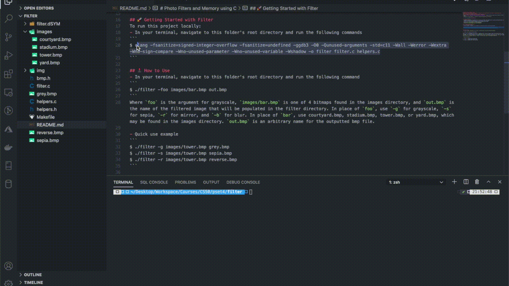

# Photo Filters and Memory using C
### Homework from [Harvard's Introduction to Computer Science CS50 hosted on eDX](https://www.edx.org/course/cs50s-introduction-to-computer-science)
### 🎓 [Problem Set 4](https://cs50.harvard.edu/x/2020/psets/4/)
- [Filter](https://cs50.harvard.edu/x/2020/psets/4/filter/less/): Apply grayscale, sepia, mirror, and blur filters to a bitmap (image)
- I wrote the code in helpers.c. The other files were provided by the instructor.



## 💡Lessons Learned
- Implementing knowledge of hexadecimals by altering individual pixel's RGB values to achieve the desired photo filter effect
- Iteration through a two dimensional array, specifically a 24-bit bitmap
- Using `copy` to save arrays into memory and to ultimately alter them
- Working with `struct RGBTRIPLE` and its parameters
- Analyzing `BITMAPINFOHEADER` and `BITMAPFILEHEADER`

## 🚀 Getting Started with Filter
To run this project locally:
- In your terminal, navigate to this folder's root directory and run the following commands
```
$ clang -fsanitize=signed-integer-overflow -fsanitize=undefined -ggdb3 -O0 -Qunused-arguments -std=c11 -Wall -Werror -Wextra -Wno-sign-compare -Wno-unused-parameter -Wno-unused-variable -Wshadow -o filter filter.c helpers.c
```

## 🕹 How to Use
- In your terminal, navigate to this folder's root directory and run the following command
```
$ ./filter -foo images/bar.bmp out.bmp
```
Where `foo` is the argument for grayscale, `images/bar.bmp` is one of 4 bitmaps found in the images directory, and `out.bmp` is the name of the filtered image that will be populated in the filter directory. In place of `foo`, use `-g` for grayscale, `-s` for sepia, `-r` for mirror, and `-b` for blur. In place of `bar`, use courtyard.bmp, stadium.bmp, tower.bmp, or yard.bmp, which may be found in the images directory. `out.bmp` is an arbitrary name for the outputted bmp file.

- Quick use examples
```
./filter -g images/tower.bmp grey.bmp
./filter -s images/tower.bmp sepia.bmp
./filter -r images/tower.bmp reverse.bmp
```

